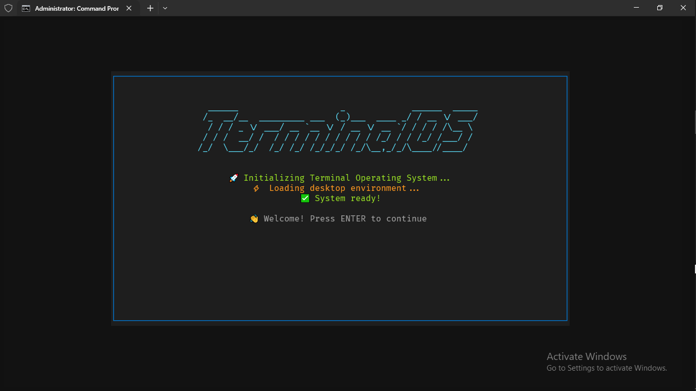
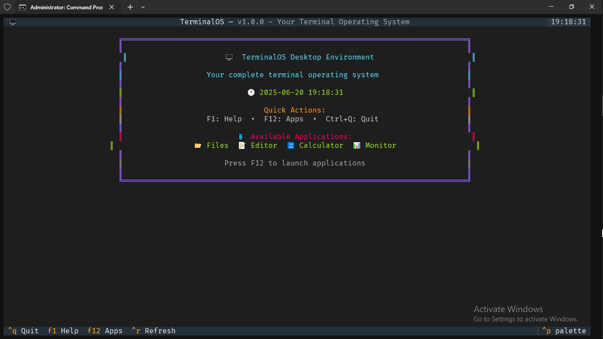
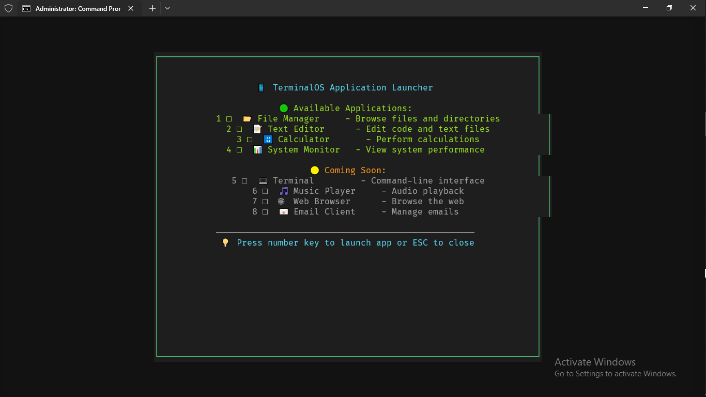

# TerminalOS  


## 🖥️ Overview

TerminalOS is a full desktop-like experience within your terminal. Built using Python and the Textual framework, it offers a responsive and visually appealing TUI (Text User Interface) with multiple applications, window management, theme support, and keyboard navigation—all running inside a terminal window.




## ✨ Features

### 🖥️ Desktop Environment

* Beautiful ASCII desktop with real-time clock and system info
* Window management with modals and multiple screen support
* Theme support: Dark, Light, Matrix, Cyberpunk
* Keyboard shortcuts for quick navigation

### 📱 Built-in Applications

| App               | Description                        | Status         | Shortcut        |
| ----------------- | ---------------------------------- | -------------- | --------------- |
| 📁 File Manager   | Browse directories and file info   | ✅ Ready        | `1` in launcher |
| 📝 Text Editor    | Syntax-highlighted file editing    | ✅ Ready        | `2` in launcher |
| 🔢 Calculator     | Scientific calculator with history | ✅ Ready        | `3` in launcher |
| 📊 System Monitor | CPU, memory, and disk usage        | ✅ Ready        | `4` in launcher |
| 💻 Terminal       | Built-in CLI emulator              | 🚧 Coming Soon | `5` in launcher |
| 🎵 Music Player   | Playlist and audio playback        | 🚧 Coming Soon | `6` in launcher |

### 🎨 Themes & Customization

* Dark, Light, Matrix, and Cyberpunk themes
* Persistent configuration settings
* Responsive layout for different terminal sizes
* ASCII art and Unicode icons

### ⌨️ Keyboard Shortcuts

* `F1`: Help
* `F12`: App Launcher
* `Ctrl+Q`: Quit
* `ESC`: Close current dialog/app
* `Tab`: Move between UI elements

## 🚀 Quick Start

 
###  Installation

```bash
git clone https://github.com/000xs/terminalos.git
cd terminalos
pip install -r requirements.txt
pip install -e .
terminalos
```

## 📋 Requirements

* Python 3.8+
* Unicode-supported terminal
* Minimum 80x24 (120x40 recommended)
* Cross-platform (Windows, Linux, macOS)

### Dependencies

* `textual>=0.41.0`
* `rich>=13.0.0`
* `click>=8.1.0`
* `psutil>=5.9.0`
* `pyfiglet>=0.8.0`
* `pygments>=2.14.0`

## 🛠️ Installation Methods

### Method 1: Direct Launcher
 

```bash
git clone https://github.com/000xs/terminalos.git
cd terminalos
pip install -e .

```
```
terminalos  
```
or
``` 
tos
```

 

## 📖 Usage Guide

### Start TerminalOS

```bash
terminalos
# Optional flags:
--debug
--no-boot
--version
```

### Navigation

* Boot screen: `Enter`
* App launcher: `F12`
* Return to desktop: `ESC`
* Help: `F1`

## 📚 Application Guide

### 📁 File Manager

* Browse using arrow keys
* View metadata in sidebar

### 📝 Text Editor

* Syntax highlighting
* Real-time line/word/char count
* Tabs and file operations

### 🔢 Calculator

* Arithmetic + scientific functions
* Keyboard/mouse input

### 📊 System Monitor

* Live CPU, memory, and disk usage

## 🎨 Theme System

### Available Themes

* Dark (Default)
* Light
* Matrix
* Cyberpunk

### Change Theme

```bash
terminalos --theme matrix
```

## ⚙️ Configuration File

Located at:

* Windows: `%USERPROFILE%\.config\terminalos\`
* Linux/macOS: `~/.config/terminalos/`

Example `config.json`:

```json
{
  "theme": "dark",
  "debug": false,
  "auto_save": true,
  "appearance": {
    "show_boot": true,
    "animations": true,
    "font_size": 12
  },
  "file_manager": {
    "show_hidden": false,
    "default_path": "~",
    "sort_by": "name"
  },
  "text_editor": {
    "syntax_highlighting": true,
    "line_numbers": true,
    "tab_size": 4
  }
}
```

## 🧩 Architecture

```
terminalos/
├── core/             # App framework
├── desktop/          # Desktop and taskbar
├── apps/             # Built-in apps
├── config/           # Settings and themes
└── utils/            # Helpers and logging
```

## 🔧 Development Guide

### Setup

```bash
git clone https://github.com/000xs/terminalos.git
cd terminalos
 
pip install -e  .
```

 
### Create Custom App

```python
from textual.screen import Screen
from textual.widgets import Header, Footer, Static

class MyCustomApp(Screen):
    def compose(self):
        yield Header()
        yield Static("Hello from my custom app!")
        yield Footer()
    
    def on_key(self, event):
        if event.key == "escape":
            self.dismiss()
```

Add to launcher in `desktop/desktop.py`:

```python
from ..apps.my_app import MyCustomApp
self.dismiss()
self.app.push_screen(MyCustomApp())
```

## 🤝 Contributing

* Bug reports: Include Python version, OS, steps
* Features: Describe use case + mockup if possible
* Pull requests: Follow PEP8, type hints, test coverage

## 📝 Changelog

### v1.0.0

* Initial release
* Desktop, file manager, editor, calculator, system monitor
* 4 themes

### v1.1.0 (Planned)

* Terminal emulator
* Music player
* Plugin system
* More themes

## 🐛 Troubleshooting

* `ModuleNotFoundError`: Use direct launcher
* Python conflict: Use correct Python version
* Missing deps: `pip install textual rich click psutil pyfiglet pygments`
* Terminal display issues: `echo $TERM`

## 🏆 Credits

* Textual, Rich
*  Terminalcraft slack channel, josia idea

## 📄 License

[MIT License ](LICENSE)

 